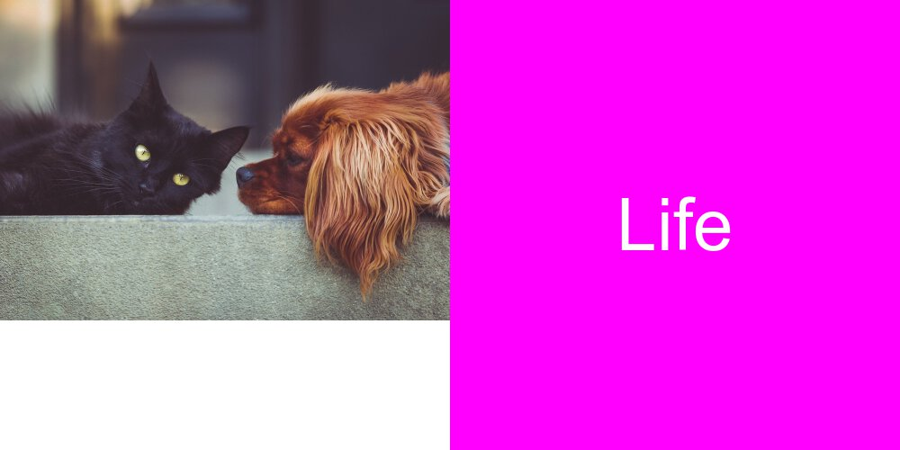

# Hello!

**Welcome to my stats220 website!😊**

## About me

My name is Katya and I like to learn new things so that is why I am here.


### Also I would like to develope my coding skills


**And now I am learning how to create memes!**


You can see a meme I made using the R package [magick](https://cran.r-project.org/web/packages/magick/vignettes/intro.html)




*How I made it*

1. I found images I liked on [Pixabay](https://pixabay.com)
2. Did Labs 1A and 1B from stats220
3. Spent some time
4. Did my best 🙃


*R code I used to make the meme*

```r

# creating squares for meme
friend_dog <- image_read("https://cdn.pixabay.com/photo/2020/04/22/19/39/dog-5079775_1280.jpg") %>%
    image_scale(250) %>%
    image_shadow(bg = "#0000ff")
sunny_day <- image_read("https://cdn.pixabay.com/photo/2017/12/15/13/51/polynesia-3021072_1280.jpg") %>%
   image_scale(250) %>%
   image_shadow(bg = "#ff1a1a")
happy_flower <- image_read("https://cdn.pixabay.com/photo/2022/02/22/03/22/passiflora-7027917_1280.jpg") %>%
   image_scale(250) %>%
   image_shadow(bg = "#00b300")


#creating blank squares with text
look_text <- image_blank(width = 250, 
                          height = 250, 
                          color = "#00ffff") %>%
  image_annotate(text = "Look", 
                 color = "#ff00ff",
                 size = 100,
                 font = "Impact",
                 gravity = "center")

life_text <- image_blank(width = 250, 
                         height = 250, 
                         color = "#ffff00") %>%
  image_annotate(text = "Life",
                 color = "#00ff00",
                 size = 100,
                 font = "Bold",
                 gravity = "center") %>%
  image_annotate(text = "Feel",
                 color = "#ff1a1a",
                 size = 50,                                     
                 font = "Bold",
                 gravity = "southwest") %>%
  image_annotate(text = "Smile",
                 color = "#ff33cc",
                 size = 50,
                 font = "Georgia",
                 gravity = "northeast") %>%
  image_modulate(brightness = 150, saturation = 100, hue = 100)

ib_text <- image_blank(width = 250, 
                       height = 250, 
                       color = "#00ff80") %>%
  image_annotate(text = "IS\nBeautiful",
                 color = "#ff4000",
                 size = 60,
                 font = "Italics",
                 gravity = "center") %>%
  image_annotate(text = "See\nit",
                 color = "#000099",
                 size = 30,
                 font = "Bold",
                 gravity = "south")
 

# creating a vector to make it work together            
first_row <- c(friend_dog, look_text) %>%
  image_append()
  
second_row <- c(sunny_day, life_text) %>%
  image_append()

third_row <- c(happy_flower, ib_text) %>%
  image_append()

meme = c(first_row, second_row, third_row) %>%
  image_append(stack = TRUE)


#saving meme as a image
image_write(meme, "my_meme.png")


``` 
